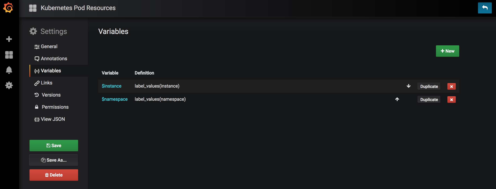
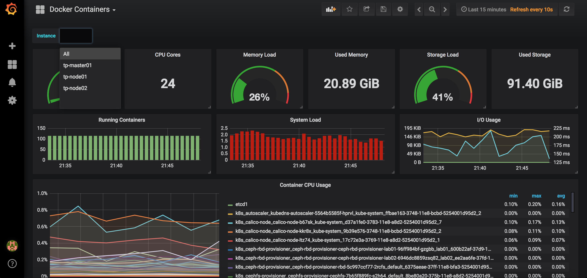

# k8s-grafana

Grafana是一個開源的監控數據分析和可視化面板(DashBoard)。最常用於對基礎設施和應用數據分析的時間串行數據進行可視化分析，也可以用於其他需要數據可視化分析的領域。Grafana可以幫助你查詢、可視化、告警、分析你所在意的指標和數據。可以與整個團隊共享，有助於培養團隊的數據驅動文化。Grafana有著非常漂亮的圖表和佈局展示，支援Graphite、zabbix、InfluxDB、Prometheus和OpenTSDB作為數據來源，本例使用Prometheus當數據來源。

註：雖然grafana本身也有簡單的告警功能，但我還是採用prometheus的alertmanager，功能也較多

INSTALL
=======

```
git clone https://github.com/sayya9/k8s-grafana.git
cd k8s-grafana/helm/grafana
helm install -n your_release_name --namespace=your_namespace .
```

DashBoard
=======

此repository的k8s dashboard參考，docker container與host dashboard則參考這個github ，另外採用group_left來使兩個不同的metrics產生關聯。

例如：想在dashboard上以主機名稱方式呈現
node_cpu{mode="user"} 產生的結果如下，instance為IP

```
node_cpu{app="prometheus-prometheus",component="node-exporter",cpu="cpu0",instance="192.168.2.5:9100",job="kubernetes-service-endpoints",kubernetes_name="node-exporter",kubernetes_namespace="default",mode="user",release="prometheus"}
node_cpu{app="prometheus-prometheus",component="node-exporter",cpu="cpu0",instance="192.168.2.6:9100",job="kubernetes-service-endpoints",kubernetes_name="node-exporter",kubernetes_namespace="default",mode="user",release="prometheus"}
```

node_uname_info{nodename="deploy01"} 產生的結果如下，instance為IP，nodename為主機名稱

```
node_uname_info{app="prometheus-prometheus",component="node-exporter",domainname="(none)",exported_release="4.15.4-1.el7.elrepo.x86_64",instance="192.168.2.5:9100",job="kubernetes-service-endpoints",kubernetes_name="node-exporter",kubernetes_namespace="default",machine="x86_64",nodename="deploy01",release="prometheus",sysname="Linux",version="#1 SMP Sat Feb 17 13:35:20 EST 2018"}
```

透過group_left合併

```
node_cpu{mode="user"} 
* on(instance) group_left(nodename) 
node_uname_info{nodename="deploy01"}
```

結果：

```
{app="prometheus-prometheus",component="node-exporter",cpu="cpu0",instance="192.168.2.5:9100",job="kubernetes-service-endpoints",kubernetes_name="node-exporter",kubernetes_namespace="default",mode="user",nodename="deploy01",release="prometheus"}
```

再與grafana內建變數(Variables)的功能，來顯示多台主機與namespace呈現的結果。





再透過ansible，當一個pod起來時，動態import datasource與dashborad json file，參考


